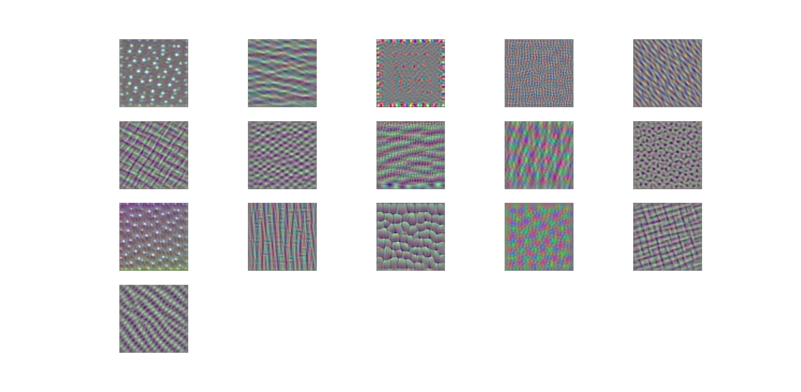
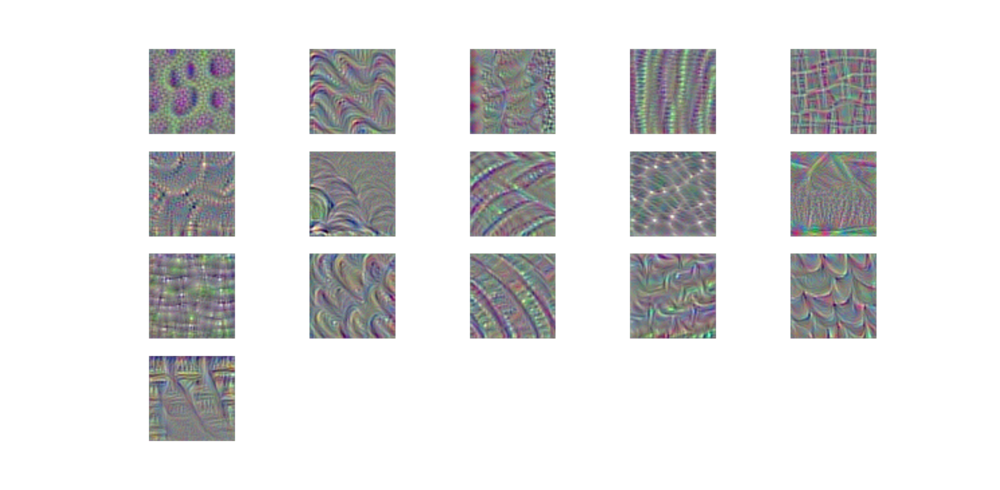

# cnn-visualizer

Visualization of the filters of VGG16, via gradient ascent in input space.

Pure tensorflow version of [How convolutional neural networks see the world](https://blog.keras.io/how-convolutional-neural-networks-see-the-world.html)

* Generated image of Convolutional Layer 3-1
	* 

* Generated image of Convolutional Layer 4-1
	* 


## Prerequisites

* python 3.5
* tensorflow 1.0.1
* numpy 1.12.0


## How to run

#### 1. Download vgg16 checkpoint file

First, you need to download the pre-learned checkpoint file.

* Download the vgg16 checkpoint file at https://github.com/tensorflow/models/tree/master/research/slim#pre-trained-models
* Extract the downloaded file.
* Move the ```vgg_16.ckpt``` file to the ```project/root/ckpts``` directory.


#### 2. Run script "main.py"

Now run main.py script. You can adjust options such as image size, layer name, and so on.

In the cpu version, it takes only a minute to create one image.


